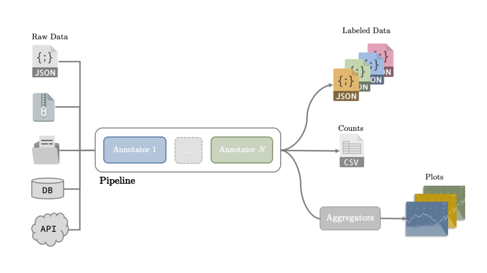
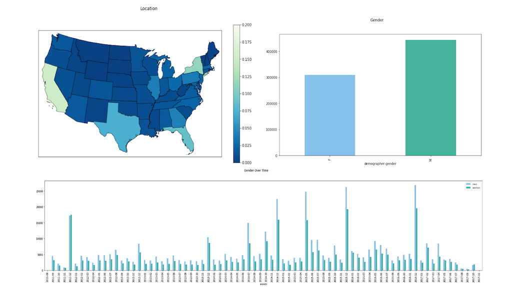

# Falconet 2.0 


Falconet is a framework for building and deploying custom data processing pipelines to transform a stream of incoming social media data into meaningful and insightful analytics. 

- Highly extensible modular architecture
- Scalable and distributable to a large computing grid
- Works in both offline and streaming settings
- Supports machine learning deployments
- Currently supports the following data sources

 

## Installing and Running

 1.  create v-env
 2.  pip install -r requirements.txt
 3.  Copy `falconet/settings/local.py.template` to `falconet/settings/local.py` and fill in variables.  
 4.  run **[cli/run.py](python/falconet/cli/run.py)** 

**Required Arguments:**
	
| Argument  | Description ||
|--|--|--|
| \-\-input | Path to the data to be processed (file or folder) | the path can be either a json plain file or compressed file with gzip or bz2. If a folder is passed the system iterates trough the respective files  |
| \-\-output_folder | Processed data and statistics will be stored in this folder |
| \-\-pipeline_conf |Path to a pipeline config file  || 
| \-\-message_type | Type of message (source) | choices = ['twitter','reddit_comment', 'reddit_submission'\] | 

**Optional Arguments:**

| Argument | Description ||
|--|--|--|
| \-\-max_messages | Process this many messages and stop ||

**Example:**

    python -m falconet.cli.run --message_type twitter --pipeline_conf pipelines/foo/pipeline.json  --input pipelines/foo/data/  --output pipelines/foo/output 

Here are few examples of pipelines: [ecigs](pipelines/ecigs/).

## System Overview 

Falconet supports the deployment of custom analytics pipelines for social media data. The data can come from a single text file, a compressed archive or a folder (reading directly from databases and web APIs coming soon). A pipeline consists of a set of _annotators_ to process a stream of social media contents, infer relevant properties and produce analytics. 



Messages represented as json objects, e.g. 

```json
{ "archived":false, "author":"nightleld1",
  "author_flair_css_class":"", "author_flair_text":"13",
  "brand_safe":true, "contest_mode":false, "created_utc":1514764800, 
  "distinguished":null, "domain":"self.teenagers", "edited":false, "gilded":0, 
  "hidden":false, "hide_score":false, "id":"7nbxvj", "is_crosspostable":false, 
  "is_reddit_media_domain":false, "is_self":true, "is_video":false, 
  "link_flair_css_class":"discuss", "link_flair_text":"Discussion", 
  "locked":false, "media":null, "media_embed":{}, "num_comments":2, "num_crossposts":0, 
  "over_18":false, "parent_whitelist_status":"all_ads", 
  "permalink":"\/r\/teenagers\/comments\/7nbxvj\/uk_new_years_eve_yay\/", 
  "pinned":false, "retrieved_on":1518480156, "score":8, "secure_media":null, 
  "secure_media_embed":{}, "selftext":"well its 2018 now for us UK bois! ", 
  "spoiler":false, "stickied":false, "subreddit":"teenagers", 
  "subreddit_id":"t5_2rjli", "subreddit_type":"public", "suggested_sort":null,
  "thumbnail":"self","thumbnail_height":null,"thumbnail_width":null,
  "title":"UK NEW YEARS EVE YAY",
  "url":"https:\/\/www.reddit.com\/r\/teenagers\/comments\/7nbxvj\/uk_new_years_eve_yay\/",
  "whitelist_status":"all_ads"
}

```
The main output of a pipeline is also a json object which preserves the original records and adds one or more inferred `annotations`, e.g.

```json
{ "archived":false, "author":"nightleld1",
  "author_flair_css_class":"", "author_flair_text":"13",
  "brand_safe":true, "contest_mode":false, "created_utc":1514764800, 
  "distinguished":null, "domain":"self.teenagers", "edited":false, "gilded":0, 
  "hidden":false, "hide_score":false, "id":"7nbxvj", "is_crosspostable":false, 
  "is_reddit_media_domain":false, "is_self":true, "is_video":false, 
  "link_flair_css_class":"discuss", "link_flair_text":"Discussion", 
  "locked":false, "media":null, "media_embed":{}, "num_comments":2, "num_crossposts":0, 
  "over_18":false, "parent_whitelist_status":"all_ads", 
  "permalink":"\/r\/teenagers\/comments\/7nbxvj\/uk_new_years_eve_yay\/", 
  "pinned":false, "retrieved_on":1518480156, "score":8, "secure_media":null, 
  "secure_media_embed":{}, "selftext":"well its 2018 now for us UK bois! ", 
  "spoiler":false, "stickied":false, "subreddit":"teenagers", 
  "subreddit_id":"t5_2rjli", "subreddit_type":"public", "suggested_sort":null,
  "thumbnail":"self","thumbnail_height":null,"thumbnail_width":null,
  "title":"UK NEW YEARS EVE YAY",
  "url":"https:\/\/www.reddit.com\/r\/teenagers\/comments\/7nbxvj\/uk_new_years_eve_yay\/",
  "whitelist_status":"all_ads", "annotations":{"genderperformr":"UNK","hiv":false}
}
```
However, since this may generate a lot of data, the pipelines can be configured to output only specific sets of fields (see next section). Optionally, the pipeline can also keep track of the annotations inferred by the models and generate summaries of those annotations. In this case, the pipeline also outputs _CSV_ files with raw counts and predefined aggregations, e.g.

```
timestamp,location-state,demographer-gender
2011-08-18,Georgia,M,12
2011-08-18,Mississippi,F,11
2011-08-18,New York,F,2
2011-08-18,New York,M,20
2011-08-18,Virginia,F,11
```

These resulting files can be readily plotted, e.g.



or be further processed to generate other indicators. Here is an [example](notebooks/ecig_notebook.ipynb) of a jupyter notebook with analytics generated from the output of a pipeline.

### Architecture 

The system has a modular and extensible architecture consisting of the following main modules

- [annotators](python/falconet/annotators/__init__.py) - Defines intefaces and provides implementations for _Annotators_ that leverage NLP methods to infer properties of the data;
 
- [classifiers](python/falconet/classifiers/classifier.py) - Provides methods to build and evaluate custom machine learning classifiers;

- [io](python/falconet/io.py) - Provides methods to read from streams of incoming data and write the outputs of the pipeline;

- [pipeline](python/falconet/pipeline.py) - Implements the core functionalities of the system such as building and running pipelines, as well as producing statistics and indicators

### External Models

Falconet can easily leverage external libraries and modules by simply wrapping them around an [Annotator](python/falconet/annotators/__init__.py) object. The current version of the system includes the following external models: 

- [Carmen](https://github.com/mdredze/carmen-python) (geo-location inference)

## Creating a New Pipeline

Pipelines are specified as json files:

```json
{
  "name":"pipeline name",
  "models_path":"path to trained models",
  "writer-style": "writer style", 
  "pipeline": [ "model1",              
              {"model":"model2",
                 "args":{"arg1":true, "arg2":["value1","value2"]}
               }],               
  "counter":{"labels":["label1", "label2", "label3", "label4"],
              "aggregations":["label1, label3", "label4, label2"],
              "period":"timestamp period", 
              "timezone":"time zone"
    }
}  
```
- `writer-style` defines how much information from the input json record is preserved 

    - _full_ -  outputs the full json record; 
    - _minimal_ - includes only a subset of the orignal record; 
    -  _id_ - outputs only the message id.

- `models_path` (optional) - path to a set of custom machine learning models
- `pipeline` - list of models in the pipeline, described as either a string or a dictionary with additional arguments:

```json
    {"model":"", "args": {}}
```

- `args` is a dictionary of model specific arguments
- `model` can be an [external model](#external-models), a [custom machine learning classifier](#deploying-custom-models) or a [keyword-based model](python/falconet/resources/annotators/keywords/diseases), e.g

```json
{ "model":"carmen",
  "args":{"keep_countries":["United States"]}}    
```

```json
{"model":"classifier",
 "args":{"prefix":"model prefix"}}
```

```json
{ "model": "keywords",
  "args": {"label":"label name", "filename":"lexicon filename","skip_misses":true}}
```

  - `prefix` is a prefix for the serialized models filename
  - `skip_misses` allows boolean models to act as 'filters': when they output _false_, the corresponding messages are discarded (optional with default as _False_).

- `counter` (optional) - defines a counter to keep track of the annotations produced by the pipeline
    - `labels` - list of labels we want to keep track of 
    - `aggregations` - list of aggregation expressions in the form _label1, ..., labelN_ (e.g. _timestamp, hiv, gender_). If this is set, then the system automatically applies the aggregations to the counts and outputs a _csv_ file with the results; one for each aggregation expression.
    - `period` specificies the granularity of the timestamps (e.g hour, day, month)

Here are few examples of pipeline configuration files: 
[twitter_keywords](pipelines/ecigs/twitter_keywords_pipeline.json),
[twitter_relevance](pipelines/ecigs/twitter_relevance_pipeline.json) 


## Deploying Custom Models

Falconet supports the deployment of custom machine learning models. The models can be trained and evaluated as described below. The serialized (i.e. pickled) models can then be added to a pipeline by pointing the `models_path` to their location and adding an entry to the `pipelines`. 

## Training Models
The models can be trained on the processed and labeled tweets using the below commands 

Run [cli.train.py](https://bitbucket.org/mdredze/falconet/src/0d89eff4bfee8fa276fc0f4ebb42ad4d295dacaf/python/falconet/cli/train.py?at=master&fileviewer=file-view-default#train.py-17)

Command Example:

    python -m falconet.cli.train --input {input_file}.json.gz --proptest {float_in(0,1)}  --home  /dir/to/save/falconet/models --prefix {prefix_to_model} --dependent {dependent_variable}

More Details: https://bitbucket.org/mdredze/falconet/src/master/python/falconet/classifiers/README

**Required Arguments:**
	
| Argument | Description ||
|--|--|--|
| \-\-input | The path to input data pre-processed ||
| \-\-home |The directory where data, resources and models will be written| |
|\-\-prefix|prefix to model/log file path||

**Dependent Variable to Predict**

Which dependent variables to build classifiers for.  If none are set, this is inferred from training data. 

| Argument | Description ||
|--|--|--|
|--dependent|which dependent variables to build classifiers for.  If none are set, this is inferred from training data.|Example: (health_relevant)|

**If working on unfolded data  arguments to pass**

Set proptest if working on data unfolded tweets. 

 1. Each example has a "fold" key with a number from 0 to (n-1), corresponding to the fold each example is assigned to. By default, examples in fold (n-1) are treated as test examples, and a model is selected by cross-fold validation over the other folds. This is the ideal case, since it means that our models will be reproduced when retraining -- modulo reordering of SGD steps. 
 2. Fold is not included in each example, in which case a --propTest flag should be used, value from 0 to 1, which corresponds to proportion of examples randomly assigned to test. Model selection is performed based on 4-fold CV on a random partition of the non-test data.

| Argument | Description ||
|--|--|--|
|\-\-proptest|The proportion of data to be held out for test, if fold is not set in the example|float in range: (0,1)|

**Model Selection   Arguments:**

Determines model selection 
E.G: 

 - how much to favor precision vs. recall
 - avoid low confidence examples

| Argument | Description |Default|
|--|--|--|
|\-\-beta|weighting of f-score between precision and recall|default=1.0|
|\-\-maxpropdropped|what proportion of low confidence examples we allow to be dropped|default=0.3|


**Model  Training   Arguments:**

Arguments for Model Training, defaults to sweeping over feature sets/regularization if not set.

See [sweep function](https://bitbucket.org/mdredze/falconet/src/0d89eff4bfee8fa276fc0f4ebb42ad4d295dacaf/python/falconet/classifiers/train.py?at=master&fileviewer=file-view-default#train.py-295) to edit/add to sweep arguments such as:

 - regularizer(l1,l2) 
 - ngram 
 - embedding dim 
 - model

 This calls class [TextTokenClassifier](https://bitbucket.org/mdredze/falconet/src/0d89eff4bfee8fa276fc0f4ebb42ad4d295dacaf/python/falconet/classifiers/classifier.py?at=master&fileviewer=file-view-default#classifier.py-319) as a classifier. 
 For  converting a collection of text documents to a matrix of token we used
  [`sklearn.feature_extraction.text`](http://scikit-learn.org/stable/modules/classes.html#module-sklearn.feature_extraction.text "sklearn.feature_extraction.text").[CountVectorizer](http://scikit-learn.org/stable/modules/generated/sklearn.feature_extraction.text.CountVectorizer.html)[�](http://scikit-learn.org/stable/modules/generated/sklearn.feature_extraction.text.CountVectorizer.html#sklearn-feature-extraction-text-countvectorizer "Permalink to this headline") .
 
| Argument | Description ||
|--|--|--|
|\-\-minngram|minimum n-gram order to extract, if either  minngram and maxngram are set to -1, extracts no n-gram features||
|\-\-maxngram|maximum n-gram order to extract||
|\-\-embeddingdim|which dimensionality of Twitter-trained GloVE embeddings to train with -- downloads them if not available|
|\-\-l1|L1 regularization of trained model; if not set, finds best-performing setting|
|\-\-l2|L2 regularization when training model|

**Bit Bucket  Arguments**

OAuth creds to access data in bitbucket repo. If none are set it reads from [falconet.settings.BITBUCKET\_OAUTH\_KEY](https://bitbucket.org/mdredze/falconet/src/0d89eff4bfee8fa276fc0f4ebb42ad4d295dacaf/python/falconet/settings.py?at=master&fileviewer=file-view-default#settings.py-153)

Also downloading data   argument  from Bitbucket is provided.

| Argument | Description ||
|--|--|--|
|\-\-bbkey|Bitbucket OAuth key with READ permission on "repositories", defaults to settings/local.py|
|\-\-bbsecret|Bitbucket OAuth secret|
|\-\-downloadall|if set, downloads all training data from bitbucket repository|default=False|


**Number of Processes to train the model with**

Set number of processes with this argument.

| Argument | Description ||
|--|--|--|
|\-\-numproc|number of processors to train with|default=1|

**Retraining Old Model Arguments**

| Argument | Description ||
|--|--|--|
|\-\-retrainmodel|Flag to retrain old model with same settings|default=False|
|\-\-modelpath|Path to trained model.Uses _trainArgs in this model to retrain.|default=None|
